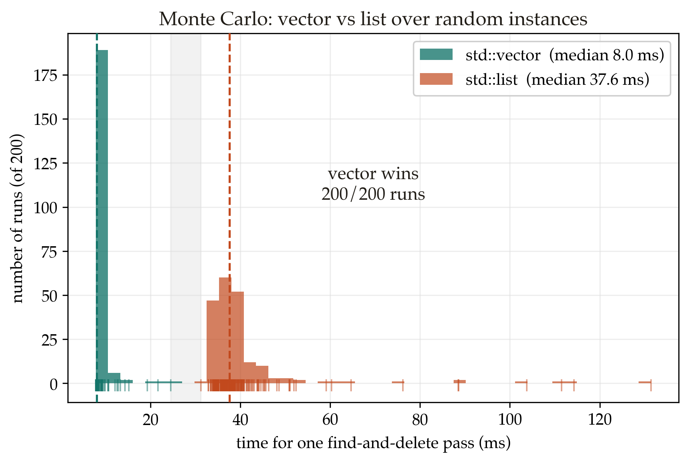

# Time Complexity Isn't All You Need

Two ways to sum the same array. The arithmetic is identical and both are O(n²).
On my laptop one of them runs about 70 times slower than the other. Nothing about
the algorithm changed, only the order the elements get read in.

Big-O is how your DSA course teaches you to choose between options, and the rule
is simple: lower asymptotic cost wins. That ranking is real, but it describes an
idealised machine where every memory access costs the same and branches are free.
No such machine exists. Real CPUs keep the data you touched recently close by and
leave everything else slow to reach. They also run ahead of you by guessing which
way each branch will go. Because of that, the constant factors Big-O throws away
often decide which option is actually faster at the sizes you run in practice.

Three experiments below. Every number is measured on one machine, and the code
is up at [github.com/tms-h/comssa-may](https://github.com/tms-h/comssa-may) so
you can run it yourself. One warning first: compile with optimisations on. At
`-O0` the numbers fall apart.

## Experiment 1: same loop, two orders

Take a 256 MB grid of ints and sum every element. The two loops below both do
that, and they only differ in which index sits on the inner loop.

```cpp
// Version A: inner loop runs over j (the contiguous direction)
long long sum = 0;
for (int i = 0; i < N; ++i)
    for (int j = 0; j < N; ++j)
        sum += a[i * N + j];
```

```cpp
// Version B: inner loop runs over i (jumps N ints each step)
long long sum = 0;
for (int j = 0; j < N; ++j)
    for (int i = 0; i < N; ++i)
        sum += a[i * N + j];
```

Both touch every element once and do the same additions. So before you scroll:
is there even a difference? Reading across rows or down columns should be the
same work, surely this is all just noise.

Here are the results.

| version | inner loop | time |
|---|---|---:|
| A (row-major) | `j` varies fastest | **5.06 ms** |
| B (column-major) | `i` varies fastest | **347.83 ms** |


A took 5.06 ms. B took 347.83 ms for the exact same sum, about 70 times slower.
The reason is that memory does not come back one int at a time. It comes in
64-byte chunks called cache lines, around sixteen ints each. Version A reads
along a row, so it uses all sixteen ints in a line before it moves on, and the
hardware notices the steady forward pattern and grabs the next line early.
Version B reads down a column, so it uses one int from a line and then jumps far
enough that the next read misses the cache again. Almost every read in B is left
waiting on main memory.

Identical Big-O, both O(n²), and one is 70 times faster than the other. School
never mentions the thing doing all the work here.

## Experiment 2: when linear search wins

Here is another one. Binary search halves a sorted array each step and runs in
O(log n), while a linear scan checks elements one at a time in O(n). And log(n) <
n for every n > 0, so binary search should win at every size. To check, I swept
the array size N and ran a lot of random lookups on a sorted array, timing each
method per query.

| N | linear (ns/query) | binary (ns/query) | winner |
|---:|---:|---:|:--|
| 8 | 4.54 | 6.02 | **linear** |
| 64 | 4.09 | 7.46 | **linear** |
| 128 | 7.38 | 8.92 | **linear** |
| 256 | 13.97 | 10.40 | binary |
| 1024 | 53.67 | 14.28 | binary |
| 65536 | 4028.54 | 42.10 | binary |


Surprising. The linear scan is faster up to about 128 elements, and 128 is not a
small array. A lot of real lookups happen in arrays smaller than that, so linear
is quietly winning across most everyday cases. The two methods cross over near
N = 256 here, and past that binary search runs away with it.

The reason is short. A small array sits in fast cache, so the scan is one tight
loop the CPU rips straight through. Binary search jumps to a spot that depends on
the comparison it just made, so the branch predictor cannot guess where it lands
and the pipeline stalls on every step. Only once the array is large do those few
jumps beat scanning thousands of elements.

So a worse Big-O beat a better one. O(n) came out ahead of O(log n) over the
whole range a hobby project is ever likely to touch, which is the exact opposite
of what the proof tells you to expect.

## Experiment 3: the cost of finding the node

This one surprised me the most. Deleting from a linked list is O(1) once you are
holding the node, while deleting from an array is O(n) because everything after
it has to shift down. Run 20,000 deletes and the list does at most 20,000 cheap
splices, while the vector can shift nearly 20,000 elements on every single
delete. On paper the vector does orders of magnitude more work. The catch the
example always skips is that you have to find the element before you can delete
it. So the workload here walks from the front to find a value, erases it, and
repeats until the container is empty.

| container | time |
|---|---:|
| `std::vector` | **49.33 ms** |
| `std::list` | **242.14 ms** |


The vector took 49.33 ms and the list took 242.14 ms, so the list is about five
times slower despite the cheaper delete. Finding the node is what costs. A list
scatters its nodes across the heap and links them with pointers, so a search
follows those pointers all over memory and eats a cache miss at almost every
node. The vector keeps everything in one block, so the search is the same fast
scan as Experiment 1 and the delete is one bulk `memmove`.

This is the result Bjarne Stroustrup is known for, that arrays beat linked lists
for most everyday work. You can feel the intuition pulling the other way. Think
of an order book, the live list of buy and sell orders in a market. Orders get
cancelled constantly, so a linked list looks perfect: O(1) to splice one out. Yet
plenty of fast order books keep their orders in contiguous arrays anyway, because
walking pointers to find the order you want to cancel costs more than the array
shuffles ever do.

One run could be luck, so here is the same workload 200 times, each with a fresh
random shuffle and delete order, timing one pass each.



The vector won all 200 runs. The shapes are the interesting part. The vector's
times bunch up near 8 ms, while the list's spread into a long tail that reaches
past 100 ms, because how scattered the nodes end up changes from one run to the
next. A tail like that is how a list turns into a random latency spike in
production, long after the Big-O on the whiteboard looked fine.

## What on earth is happening?

A few pieces of hardware explain all three results.

- **The cache hierarchy.** Memory is not one flat pool. Your CPU has a few tiny
  fast caches right next to it and a big slow main memory further out. Reading
  from the nearest cache takes about a nanosecond, reaching main memory takes
  about a hundred. Data you used recently, or data sitting right beside it, is in
  the fast tier. Everything else makes you wait.
- **Prefetching.** The CPU watches how you read memory. When you move through it
  in a straight line, it fetches the chunks ahead of you before you ask. Walk
  forward through an array and it keeps pace for free. Jump around, like a column
  walk or a pointer chase, and it cannot guess what you will need.
- **Branch prediction.** The CPU does not wait to learn which way an `if` goes.
  It guesses and runs ahead. Guess right and the branch was almost free. Guess
  wrong, which is what binary search's data-dependent jumps cause, and it throws
  away the work it started and begins again.
- **The pattern.** In all three experiments, contiguous memory read in order beat
  the cleverer structure with the better complexity on paper. Reach for a flat
  array first, and only move to pointers once you have measured a reason to.

Big-O is still the right way to think about how cost grows when inputs get big,
and at a big enough N it always wins. The catch is that courses treat the ranking
as the final answer, when on real hardware it is closer to the starting point.
Keep both ideas at once: Big-O tells you how things scale, and the cache and the
pipeline decide who is faster at the size you are actually running. When it
matters, measure it, with an optimised build, a warm-up, a few runs, and the
minimum taken. The two loops at the top of this page were a few characters apart
and 70 times apart in speed. Once you start measuring, you find that gap
everywhere.

## Further reading

- **Bjarne Stroustrup**, who created C++. His list versus vector demonstration is
  the direct source of Experiment 3 and the fastest way to see the effect for
  yourself.
- **Scott Meyers**. His book *Effective C++* is the classic next step in the
  language, and he has a talk on CPU caches that lines up with Experiments 1 and 2.
- **Mike Acton**. His CppCon talk on data-oriented design pushes this idea much
  further, building whole programs around how the data sits in memory.
- **Google Benchmark**, the library you would actually reach for to measure this
  properly, rather than the small harness in this repo.
