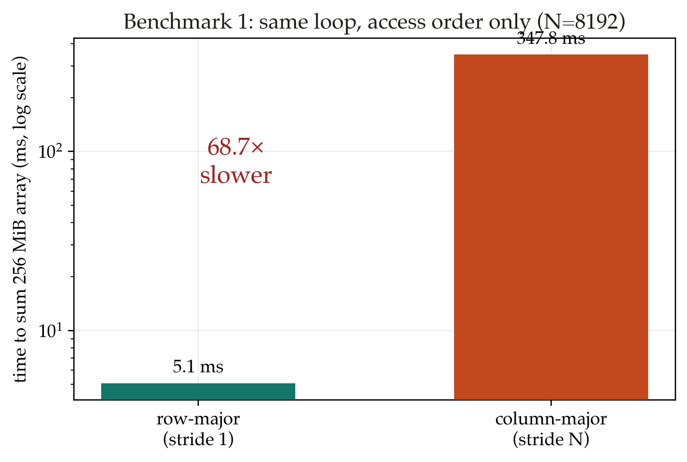
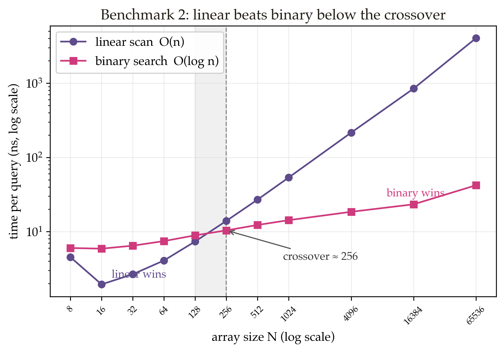
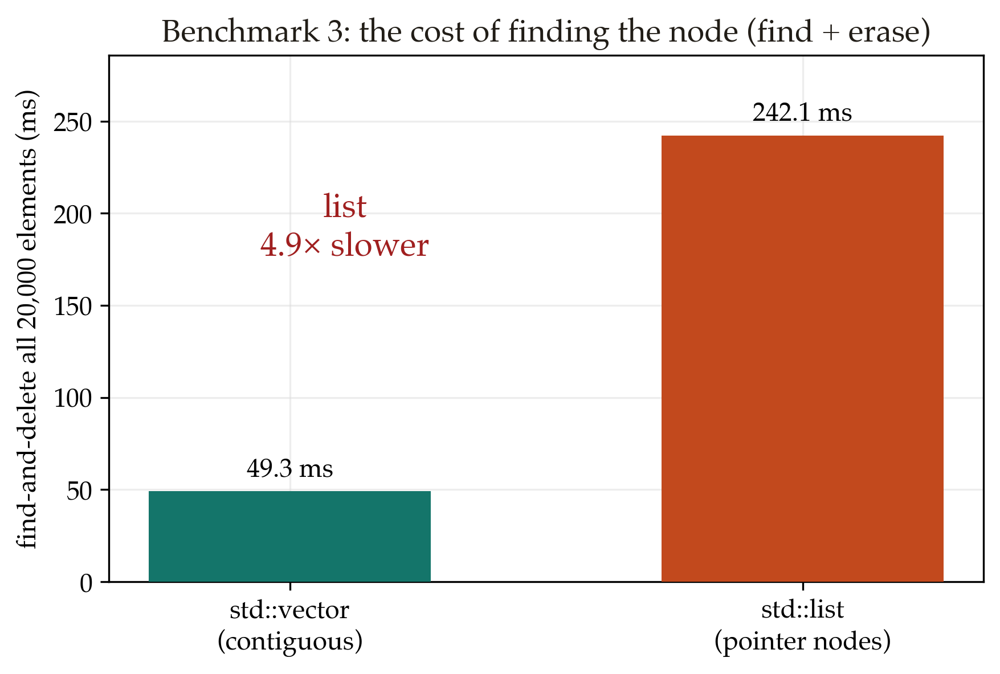

# Time Complexity Isn't All You Need

Big-O ranks algorithms on an imaginary computer. On a real one, how you touch memory often matters more.

Your DSA course ranks data structures by Big-O, and the rule is simple: lower
asymptotic cost wins. That assumes a machine where every memory access costs the
same and branches are free. Real hardware is not like that. It keeps recently
used data in fast cache and leaves the rest slow to reach. It also runs ahead of
you by guessing which way your branches will go. So the constants that Big-O
drops often decide the real winner.

Three quick measurements from my laptop make the point.

**Summing a 256 MB grid** row by row takes 5 ms. Summing the same grid column by
column takes 348 ms, about 70 times slower. The row walk uses every cache line it
loads, while the column walk wastes most of each line and waits on memory.

**Searching a sorted array,** a plain linear scan beats binary search up to about
128 elements. The scan is one tight loop the CPU rips through, while binary
search jumps around and stalls its branch predictor. Binary only pulls ahead once
the array gets large.

**Deleting from a `std::list`** is O(1) and from a `std::vector` is O(n), yet
finding then deleting every element runs about 5 times faster on the vector.
Walking the list chases pointers across the heap and misses cache at every node,
while the vector scans one contiguous block.

The pattern is the same each time. Contiguous memory read in order beats a
cleverer structure with a better complexity on paper. Big-O still tells you how
cost scales as inputs grow, but the cache and the pipeline decide who is faster
at the size you actually run. When it matters, measure it.

*Full code and the longer write-up: [github.com/tms-h/comssa-may](https://github.com/tms-h/comssa-may)*
